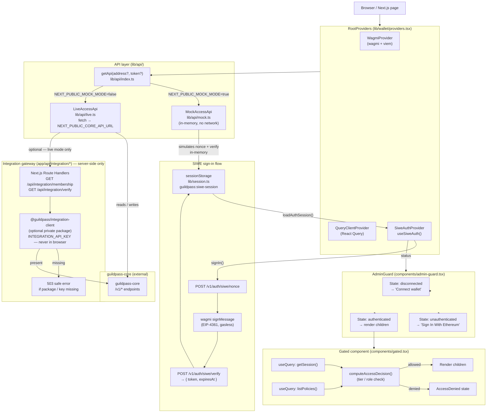
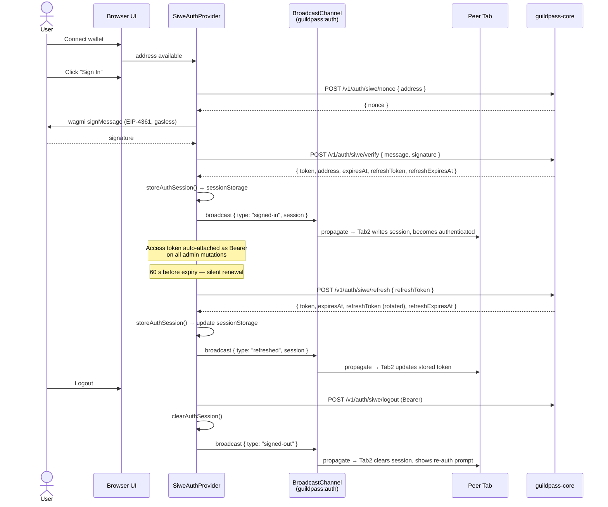
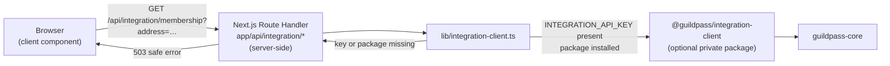

# Architecture

This document describes the high-level architecture of the GuildPass frontend
(`guildpass-integrations`), with a focus on the data-flow paths that are hardest
to reconstruct from the source alone: the mock/live API switch, the SIWE
authentication context, the gated-content decision chain, and the optional
server-side integration gateway.

---

## Request-flow diagram

---

## Component / module reference

| Path | Role in the diagram |
|------|---------------------|
| `app/*` | Next.js App Router pages (`/dashboard`, `/admin`, `/resources/[resourceId]`, `/events/demo`, `/developer`) |
| `lib/wallet/providers.tsx` | `RootProviders`: composes `WagmiProvider`, `QueryClientProvider`, and `SiweAuthProvider`; exposes `useSiweAuth()` |
| `lib/api/index.ts` | `getApi(address?, token?)` — returns `MockAccessApi` or `LiveAccessApi` based on `NEXT_PUBLIC_MOCK_MODE` |
| `lib/api/live.ts` | Fetches real data from `guildpass-core`; raises `AuthError` on 401 |
| `lib/api/mock.ts` | In-memory mock; simulates SIWE nonce/verify without a real signature |
| `lib/api/types.ts` | Shared TypeScript types (auto-generated from `test/fixtures/openapi.json`) |
| `lib/api/access-decision.ts` | Pure function: computes allow/deny from a session + policy (tier + role check) |
| `lib/session.ts` | `sessionStorage` helpers — persists and loads the SIWE token under `guildpass:siwe-session` |
| `lib/wallet/config.ts` | Builds the wagmi config from `NEXT_PUBLIC_WALLET_*` env vars |
| `lib/config.ts` | Validates all `NEXT_PUBLIC_*` env vars at startup; throws `ConfigError` on bad values |
| `lib/features.ts` | Feature-flag helpers; reads `NEXT_PUBLIC_FEATURE_*` env vars |
| `lib/query/member-cache.ts` | Patches the cached `['members']` list in place after role mutations; falls back to a full invalidate when no usable cache entry exists (never a silent no-op) |
| `components/admin-guard.tsx` | Three-state gate: `disconnected` → `unauthenticated` → `authenticated`; shows inline SIWE prompt |
| `components/gated.tsx` | Fetches session + policies, computes access decision, renders children or `AccessDenied` |
| `components/wallet/connect-button.tsx` | Three-state wallet button (disconnected / connected / authenticated) |
| `components/nav.tsx` | Navigation bar; hides feature-flagged links automatically |
| `app/api/integration/*` | Server-side Next.js route handlers; wraps `@guildpass/integration-client` |
| `lib/integration-client.ts` | Loads the optional private package at runtime; normalises its responses; never runs in the browser |
| `test/fixtures/openapi.json` | OpenAPI schema that defines the canonical contract for `lib/api/types.ts` |
| `scripts/sync-api-types.js` | Zero-dependency compiler: converts `openapi.json` → `lib/api/types.ts` |
| `app/members/[address]/page.tsx` | Public, read-only profile view — feature-flagged (`NEXT_PUBLIC_FEATURE_PROFILES`), no `<Gated>` (reads are public), no wallet required to view |
| `components/dashboard/profile-editor.tsx` | Self-service profile editor embedded in the dashboard's "Profile" card; `updateProfile()` is the one `MemberAccessApi` mutation and requires a SIWE bearer token |
| `lib/validation/profile.ts` | `validateProfile()` — field-level validation (length limits, `http(s)` URL checks, social-link dedup), mirrors `lib/validation/policy.ts`'s `{valid, errors}` shape |

---

## SIWE authentication flow (sequence)

> In **mock mode** all SIWE endpoints (including `/refresh`) are simulated in
> `lib/api/mock.ts` — no backend or MetaMask signature required.
>
> See [docs/refresh-token-contract.md](./refresh-token-contract.md) for the
> precise backend contract that `guildpass-core` must implement.

### Member profile edits reuse the SIWE session (no separate auth mechanism)

`MemberAccessApi.updateProfile()` (self-service profile editing, #254) is the
one mutation that lives outside `AdminAccessApi` yet still requires a token.
Rather than adding a second, lighter-weight auth mechanism for non-admin
mutations, it reuses the exact SIWE session shown above — the same
`SiweAuthProvider` / `useSiweAuth()` context, the same token storage, the same
cross-tab sync. The only difference from an admin mutation is authorization,
not authentication: the backend must accept the request when the token's
address matches the `address` in the path, with no role check. The frontend
mirrors this — `components/dashboard/profile-editor.tsx` calls `signIn()`
directly rather than routing through `<AdminGuard>` (which layers on a role
check this flow doesn't need), and checks `profile.address === this.address`
client-side before sending the request (`lib/api/live.ts` /
`lib/api/mock.ts`) as a UX guard, not the real security boundary.

---

## Integration gateway flow

`INTEGRATION_API_KEY` is a **server-only** environment variable and is never
bundled into browser JavaScript.
